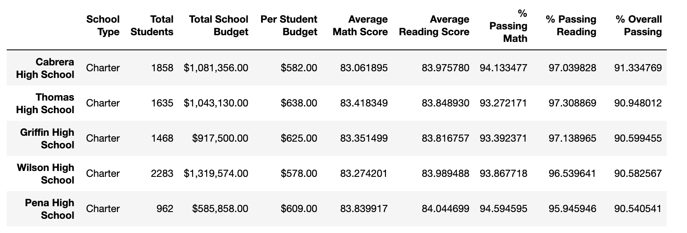
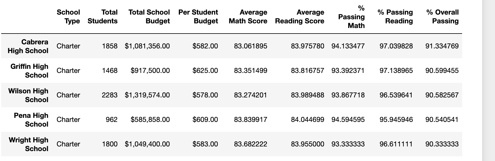
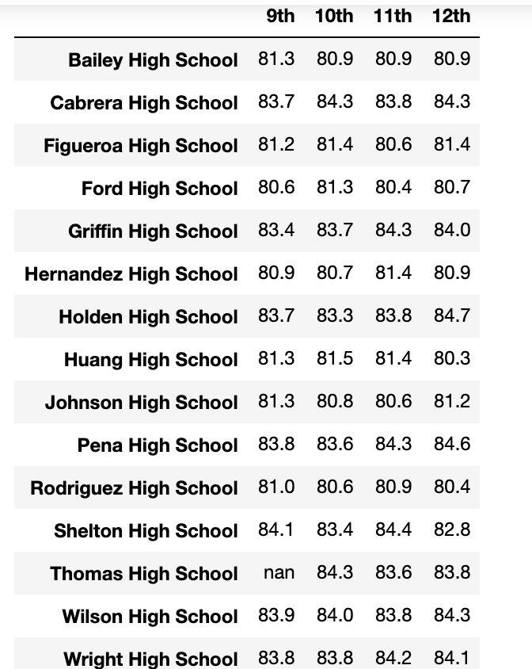
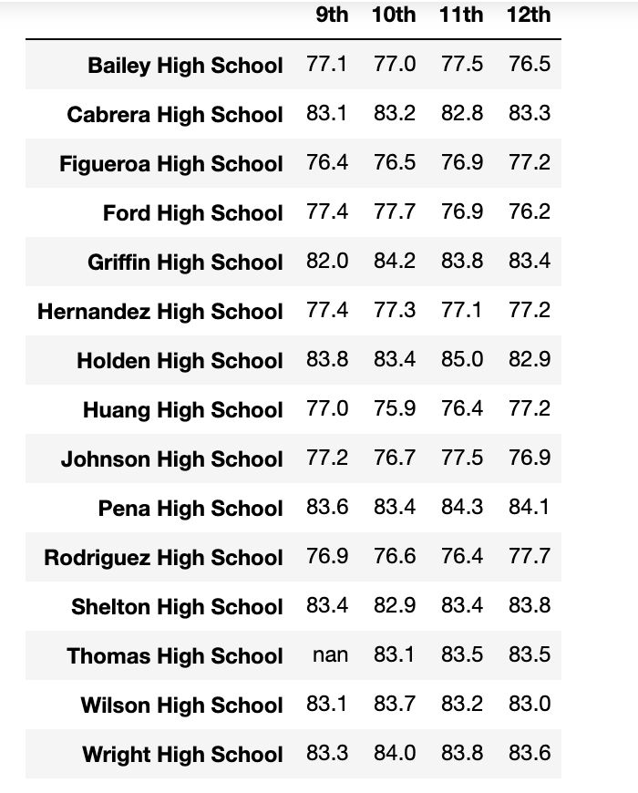

# School_District_Analysis

## Overview of Project
In this assignment, we are helping Maria, a data analysis expert, to perform a research on a large group of students’ academic performance among 12 schools. The purpose of this research is to understand how the percentage of passing students are affected by the school size, school spending and school type. In addition to the above, we are given an extra task. A school is under investigation for academic dishonesty so we want reexamine our research by excluding that particular school’s scores. 

### Raw Data
Before we started our research, we would like to give a brief introduction about our raw data. We are given two separate spread sheets: school data sheet and student data sheet. 15 schools information are given in the school data sheet, including their size, budget and school type. 39170 rows of student information are presented in the student data sheet includes their grade, school name and scores for math and reading. 

## Analysis and Challenges
### How is the district summary affected?
The average math score shows decrease from 79% to 78.9%. All the passing rate are affected and drops from the initial rate. The percentage of passing math drops from 75% to 74%, percengtage of passing reading drops from 86% to 85%.The overall passing rate drops from 65% to 64%
### How is the school summary affected?
Thomas High schools shows remarkable change in its percange of passing. The percentage of passing math, reading and overall was 93.27%, 97.31% 90.95% to 66.91,66.96% and 65.08%. There is slightly change in its average score in math and reading, from 83.41 and 83.85 to 83.35 and 83.90.

### How does replacing the ninth graders’ math and reading scores affect Thomas High School’s performance relative to the other schools?

Thomas high school was one of the top 5 schools and ranked as the second among all the school based on its overall passing rate. However, after replacing the 9th grades, Thomas high school drops from the top school list but still not yet becomes the worset school as it still has overall passing rate of 65.08%. 

#### How does replacing the ninth-grade scores affect the following:

#### Math and reading scores by grade
Obviously the biggest difference will be the 9th grades scores of Thomas high school for both reading and math shown in the table will be Nan as we replaced the 9th grades scores for Thomas high school.

#### Scores by school spending
School spending range $630 to 644 (per student) shows dramatically decrease, as Thomas high school is in this range. The percentage of passing math, reading and overall change from 73% 84% 63% to 67% 77% 56%.

#### Scores by school size
School size range medium shows dramatically decrease, as Thomas high school is in this range. The percentage of passing math, reading and overall change from 94% 97% 91% to 88% 91% 85%.

#### Scores by school type
School type charter shows dramatically decrease, as Thomas high school is in this range. The percentage of passing math, reading and overall change from 94% 97% 90% to 90% 93% 87%.

## Summary: 

The first major change will be Thomas high school’s percentage of passing rate for math, reading and overall all dropped down after we replace its ninth grades score. And the reason is very straightforward: with less valid data to be considered into the number of passing student, while the total student of Thomas high school remains the same, the percentage will be less.

The second major change is that when the Thomas high school changes its percentage of passing, the lists of top schools and bottom school are affected and a new list of top 5 are generated as Thomas high school exit the top list. Thus, even the other schools percentage stay the same, the relatively “high” or “low” percentage changes. This is great insight for us when we analyzing a large data set. Even only changing a small part of the code or very few lines of condition, the final output, especially when we compared the date based on its category, will change as the result are related to each other. 

Thirdly, I want to discuss the table of scores based on its grades. The reason is that in this table, we can find out only 9th grade of Thomas high school are replaced with Nan and the other grades from 10th to 12th of Thomas high school are still presented with number value. And this is important because when we present our research to our audience, they may not full be aware of which parts causes the change and this table can be the best supporting evidence for us to let them know the ninth grades is the only factor that changes.

Last change we want to discuss here is that the change of Thomas high school’s percentage of passing affects all its corresponding groups. For example, Thomas high school is a medium size, charter type school that has spending per student as $630-$644. When Thomas high school percentage drops, the percentage of passing student in medium size school group drops too. The same logic applies to the charter type school group and spending from $630 to $644 too. This shows that when we analyzed data based on its group or category or certain factor, the result of the group will change when the individual inside of the group changes. 
